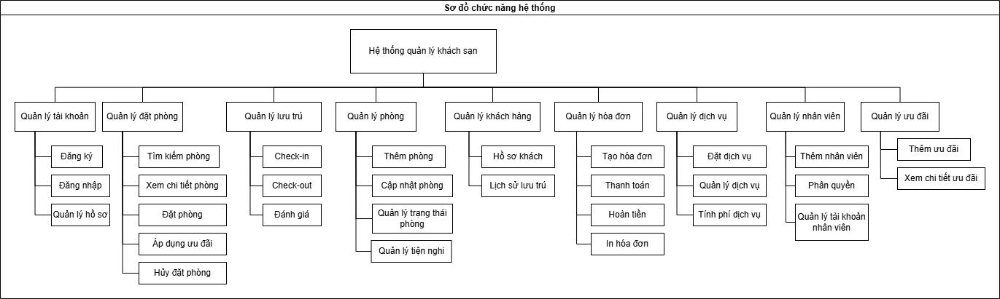
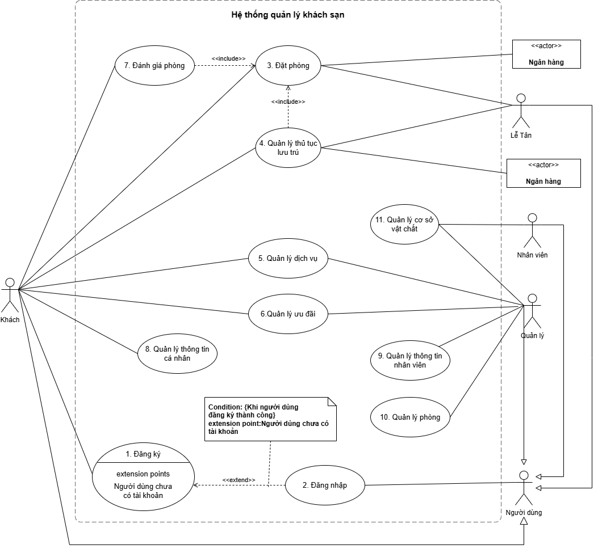
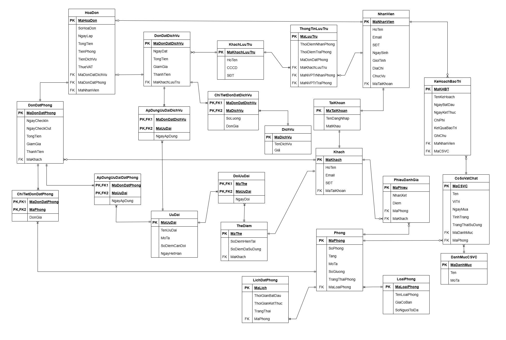

# 🏨 Hotel Management System

> A Business Analysis case study for designing an end-to-end Hotel Management System that digitizes hotel operations, improves operational efficiency, and enhances customer experience.

---

## 📌 Project Overview

The Hotel Management System is a business analysis project developed to address operational challenges commonly faced by small and medium-sized hotels. The project focuses on replacing manual processes with a centralized management system that supports room reservations, guest management, check-in/check-out, payment processing, facility management, customer loyalty, and service quality monitoring.

Rather than focusing on software development, this project emphasizes **business analysis**, including requirement elicitation, business process modeling, system analysis, and documentation.

---

## 🚩 Business Problem

Many hotels still manage daily operations using spreadsheets, paper records, or disconnected software. This results in several business issues:

- Room availability is not updated in real time, causing booking conflicts.
- Check-in and check-out procedures are time-consuming.
- Additional service charges are difficult to track.
- Customer information is scattered across different records.
- Facility maintenance is difficult to monitor.
- Managers lack centralized reports for operational decision-making.
- Hotels have limited capabilities to retain returning customers through loyalty programs.

The organization required a centralized information system capable of standardizing business processes while improving operational efficiency and customer satisfaction.

---

## 🎯 Project Objectives

The project aims to:

- Digitize hotel business operations.
- Improve reservation accuracy.
- Streamline guest check-in and check-out.
- Centralize customer and employee information.
- Support facility maintenance management.
- Improve service quality through customer feedback.
- Build customer loyalty using reward programs.
- Provide managers with better operational visibility.

---

# 👥 Stakeholders

| Stakeholder | Responsibility |
|-------------|----------------|
| Customer | Search rooms, make reservations, manage bookings, request services, submit reviews |
| Receptionist | Reservation support, check-in, check-out, payment, invoice generation |
| Manager | Manage hotel operations, rooms, employees, services, promotions, reports |
| Technician | Update facility status and maintenance activities |
| Payment Gateway / Bank | Process online payment transactions |

---

# 💼 My Role

**Business Analyst**

Responsibilities included:

- Analyzed business problems and operational workflows.
- Identified business requirements.
- Defined functional and non-functional requirements.
- Modeled business processes.
- Designed system behaviors using UML.
- Produced requirement documentation.
- Supported system design by translating business requirements into functional specifications.

---

# 📌 Project Scope

## Customer

- Register account
- Login
- Search available rooms
- Book rooms
- Cancel reservations
- Make online payment
- View promotions
- Redeem loyalty points
- Submit reviews
- Manage personal profile

---

## Receptionist

- Walk-in booking
- Guest check-in
- Guest check-out
- Payment processing
- Invoice generation

---

## Manager

- Room management
- Room type management
- Employee management
- Facility management
- Service management
- Promotion management
- Customer review management

---

## Technician

- Update room status
- Record maintenance requests
- Manage facility conditions

---

# 🔍 Business Analysis Process

The project followed a structured Business Analysis workflow.

```text
Business Problem
        │
        ▼
Stakeholder Analysis
        │
        ▼
Requirement Elicitation
        │
        ▼
Requirement Analysis
        │
        ▼
Business Process Modeling
        │
        ▼
Use Case Analysis
        │
        ▼
Functional Specification
        │
        ▼
System Design Support
```

---

# 📑 Requirements Analysis

## Functional Requirements

The system includes the following major business modules:

- User Authentication
- Room Reservation
- Check-in / Check-out
- Room Management
- Facility Management
- Employee Management
- Service Management
- Promotion & Loyalty Program
- Customer Review Management

---

## Non-functional Requirements

- User-friendly interface
- Fast response time
- High availability
- Secure authentication
- Role-based authorization
- Data backup
- Scalability
- Maintainability

---

# 🏗️ Business Modules

## Reservation Management

Supports room searching, reservation, online payment, and booking cancellation.

Business Value

- Reduce booking conflicts.
- Improve booking experience.
- Increase reservation efficiency.

---

## Room Management

Allows managers to manage room information, room types, and room availability.

Business Value

- Real-time room status.
- Better room utilization.
- Easier operational monitoring.

---

## Guest Check-in / Check-out

Supports fast guest verification, payment processing, invoice generation, and automatic room status updates.

Business Value

- Reduce waiting time.
- Standardize reception workflows.
- Improve customer satisfaction.

---

## Facility Management

Tracks room facilities, maintenance history, and repair requests.

Business Value

- Prevent equipment failures.
- Improve maintenance planning.
- Extend facility lifecycle.

---

## Service Management

Supports additional hotel services such as laundry, transportation, and food ordering.

Business Value

- Increase hotel revenue.
- Improve guest experience.

---

## Loyalty Program

Supports reward points and promotional campaigns.

Business Value

- Improve customer retention.
- Encourage repeat bookings.

---

## Customer Review

Allows verified guests to submit reviews after checkout.

Business Value

- Collect customer feedback.
- Improve service quality.
- Increase hotel credibility.

---

# 📷 System Modeling

## Functional Decomposition
<p align="center">
  
</p>

## Use Case Diagram
<p align="center">
  
</p>

## Activity Diagram

> (View detail at Diagrams/Activity_Diagram)

## Sequence Diagram

> (View detail at Diagrams/Sequence_Diagram)

## Entity Relationship Diagram
<p align="center">
  
</p>

# 🛠️ Tools Used

| Category | Tools |
|----------|-------|
| Requirement Documentation | Microsoft Word |
| UML Modeling | Draw.io |
| Diagram Design | Draw.io |
| Database Design | SQL Server |
| UI Prototype | Figma |

---

# 📚 Key Deliverables

- Business Requirement Specification
- Functional Requirement Specification
- UML Models
- Database Design
- Business Process Documentation
- System Analysis Report

---

# 🎯 Key Outcomes

The proposed solution provides an integrated platform that standardizes hotel operations from reservation to checkout while improving information accuracy and operational efficiency.

Expected business benefits include:

- Reduced manual workload.
- Better room utilization.
- Faster guest services.
- Improved operational transparency.
- Better customer retention through loyalty programs.
- More effective facility management.

---

# 📖 Lessons Learned

Through this project, I strengthened my ability to:

- Analyze business problems.
- Gather and organize business requirements.
- Translate business needs into functional requirements.
- Design UML diagrams for system analysis.
- Document system requirements professionally.
- Think from both business and system perspectives.

---

# 📁 Repository Structure

```
Hotel-Management-System/
│
├── README.md
│
├── docs/
│
├── diagrams/
│
├── prototype/
│
└── report/

```

---

# 👨‍💼 Business Analyst Skills Demonstrated

- Business Requirement Analysis
- Functional Requirement Analysis
- Non-functional Requirement Analysis
- Business Process Modeling
- UML Modeling
- Stakeholder Analysis
- System Analysis
- Requirement Documentation
- Business Documentation
- Problem Solving
- Analytical Thinking

---

## 📄 License

This repository is created for educational and portfolio purposes only.
